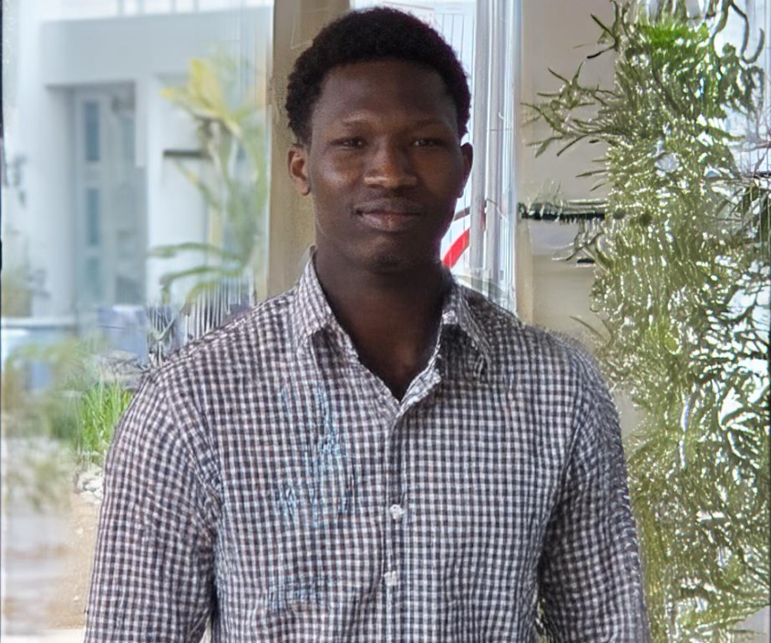

<h1 align="center">Abdoul Ouedraogo</h1>
<h3 align="center">🚀 AI Engineer Elite | Data Scientist | ML Researcher</h3>

  

---

## 👨‍💻 About Me

- 🧠 Specialized in Machine Learning & AI Systems  
- 📊 Advanced Data Analytics & Predictive Modeling  
- 🌱 Agricultural & Educational AI Research  
- ⚡ Building scalable intelligent systems  

 

---

## 🛠️ Tech Stack

  

---

## 🏆 Réalisations

- 🔥 Predictive model for student performance progression  
- 🌾 AI crop yield prediction system  
- 📈 Multi-dataset statistical analysis pipelines  
- 🤖 Automated ML optimization workflows  

---

## 📚 Research & Publications

- **AI-driven Agricultural Prediction Models**  
- **Deep Learning for Educational Progress Analytics**  
- **Optimization Algorithms for Data Systems**

---

## 📊 GitHub Activity

  
  

---

## 🐍 Contribution Snake

  

---

## 🌐 Connect with me

  
  
  

---

⭐ *Building the future with Artificial Intelligence*